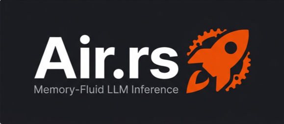

<p align="center">
  
</p>

<h1 align="center">Air.rs</h1>

<p align="center">
  <strong>S.L.I.P. — Slipstream Layer Inference Protocol</strong><br>
  Run models larger than your VRAM — streaming weights from NVMe via mmap.
</p>

<p align="center">
  <a href="#features"></a>
  <a href="#prerequisites"></a>
  <a href="#prerequisites"></a>
  <a href="LICENSE"></a>
</p>

---

## The Problem

Large language models don't fit in VRAM. A 70B-parameter model at FP16 needs **140 GB** of GPU memory. Even quantized to Q4, that's still **35 GB** — more than a consumer RTX 4090's 24 GB.

Current solutions:
- **CPU offloading** → 10–50× slower inference
- **Model parallelism** → requires multiple expensive GPUs
- **Aggressive quantization** → degrades output quality

## The Air.rs Solution

Air.rs implements **S.L.I.P.** (**S**lipstream **L**ayer **I**nference **P**rotocol): the GGUF file is memory-mapped but only **one layer's worth of quantized weights** is resident in physical RAM at any time. Weights stay compressed in GGUF block formats — `QMatMul` performs dequantize-on-the-fly during matrix multiplication.

```
 ┌──────────────────────────────────────────────────────────────┐
 │                     S.L.I.P. Pipeline                        │
 │                                                              │
 │  GGUF on NVMe ──mmap──→ Virtual Address Space (RSS ≈ 0)     │
 │                              │                               │
 │  Per token, per layer:       ▼                               │
 │    prefetch(layer N+1)  ← SSD reads ahead (madvise)          │
 │    load_layer(N)        ← QTensor → QMatMul (RSS += 1 layer) │
 │    transformer_block()  ← quantized forward pass             │
 │    drop(weights)        ← RSS -= 1 layer                     │
 │    release(layer N-1)   ← madvise(DONTNEED), pages freed     │
 └──────────────────────────────────────────────────────────────┘

 Steady-state RSS:  ~400 MB for 7B  •  ~1.5 GB for 70B
 (vs 4 GB / 40 GB file sizes)
```

**Result:** Run 70B+ models on a single consumer GPU with minimal RAM usage.

## Features

- 🚀 **Layer-Streamed Inference** — only one transformer block's weights in memory at a time
- 🗜️ **Quantized-In-Place** — weights stay in GGUF block format; `QMatMul` dequantizes during matmul
- 📄 **Native GGUF Support** — memory-maps model files with zero parsing overhead
- 🗺️ **madvise Page Control** — prefetches upcoming layers, releases finished layers from RSS
- 💾 **KV-Cache Shuttle** — swaps attention caches between RAM and VRAM per-layer
- 🔁 **Triple-Buffer Pipeline** — overlaps NVMe reads, PCIe transfers, and GPU kernels
- 🔌 **OpenAI-Compatible API** — drop-in `/v1/chat/completions` endpoint via Axum
- ⚡ **Candle CUDA Backend** — cudarc 0.13 for fused GPU kernels

## Architecture

```
src/
├── main.rs              # CLI entry point
├── lib.rs               # Module declarations, constants
├── loader.rs            # GGUF parser — extracts tensor offsets + model config
├── weight_streamer.rs   # S.L.I.P. core — mmap + per-layer QMatMul streaming
├── manifest.rs          # Execution planner — groups tensors into page-aligned chunks
├── uploader.rs          # Transfer engine — async triple-buffered NVMe→VRAM pipeline
├── orchestrator.rs      # Tensor hydrator — maps VRAM pointers into Candle tensors
├── generator.rs         # Inference loop — layer-streamed token generation
├── model.rs             # Transformer block — QBlockWeights + quantized forward pass
├── ops.rs               # Math ops — RMSNorm, RoPE, SiLU FFN (QMatMul), softmax
├── sampler.rs           # Token sampling — temperature, top-p, top-k, repetition penalty
├── tokenizer.rs         # BPE tokenizer — encode/decode from GGUF vocabulary
├── kv_cache.rs          # KV-cache manager — shuttles attention state RAM↔VRAM
├── api.rs               # OpenAI-compatible HTTP API (Axum)
└── python.rs            # Optional PyO3 bindings
```

## Prerequisites

| Requirement | Version |
|---|---|
| **Rust** | 1.75+ (2021 edition) |
| **CUDA Toolkit** | 12.x |
| **NVIDIA GPU** | Compute capability 7.0+ (Turing/Ampere/Ada/Hopper) |
| **MSVC** (Windows) | Visual Studio 2022 (Professional/Community/Build Tools) |
| **Windows SDK** | 10.0.x (included with VS2022) |
| **OS** | Windows 10/11, Linux (Ubuntu 22.04+) |

## Quick Start

### 1. Download a GGUF Model

Any GGUF-format model works. For testing, grab a small one:

```bash
# TinyLlama 1.1B (Q4_K_M, ~670 MB)
# Download from: https://huggingface.co/TheBloke/TinyLlama-1.1B-Chat-v1.0-GGUF
```

### 2. Build on Windows 11

**Option A — Using the setup script (recommended):**

```powershell
# Set up Windows SDK + MSVC lib paths (run once per terminal session)
. .\setup_env.ps1

# Build (CPU mode — no CUDA feature flag)
cargo build --release --no-default-features

# Build (with CUDA)
cargo build --release --features cuda
```

**Option B — Using VS Developer Command Prompt:**

Open **"Developer Command Prompt for VS 2022"** from the Start menu, then:

```cmd
cargo build --release --no-default-features
```

This automatically sets `LIB`, `INCLUDE`, and `PATH` for the linker.

**Option C — Set `LIB` manually:**

```powershell
$env:LIB = "C:\Program Files (x86)\Windows Kits\10\Lib\10.0.26100.0\um\x64;C:\Program Files (x86)\Windows Kits\10\Lib\10.0.26100.0\ucrt\x64;C:\Program Files\Microsoft Visual Studio\2022\Professional\VC\Tools\MSVC\14.44.35207\lib\x64"
cargo build --release --no-default-features
```

> **Note:** Replace `10.0.26100.0` and `14.44.35207` with the SDK and MSVC versions installed on your system.

### 3. Run

```powershell
# Basic generation
cargo run --release --no-default-features -- --model path/to/model.gguf --prompt "Hello, world!"

# With sampling parameters
cargo run --release --no-default-features -- \
  --model path/to/model.gguf \
  --prompt "Tell me a joke" \
  --temperature 0.9 \
  --top-p 0.95 \
  --top-k 40 \
  --max-tokens 256
```

### Build on Linux

```bash
# No special setup needed — system libs are found automatically
cargo build --release --no-default-features
```

### Troubleshooting

<details>
<summary><strong>LNK1181: cannot open input file 'bcrypt.lib' (or kernel32.lib, ws2_32.lib)</strong></summary>

This means the Windows SDK `LIB` path is not set. Solutions (pick one):

1. **Use the setup script:** `. .\setup_env.ps1`
2. **Use VS Developer Command Prompt** (sets everything automatically)
3. **Set `LIB` manually** (see Option C above)

The root cause is building outside a Visual Studio Developer Command Prompt where `LIB` isn't populated.

</details>

<details>
<summary><strong>CUDA not available, falling back to CPU</strong></summary>

1. Ensure CUDA Toolkit 12.x is installed: `nvcc --version`
2. Build with the `cuda` feature: `cargo build --release --features cuda`
3. Check that `CUDA_PATH` is set: `echo $env:CUDA_PATH`

</details>

## How It Works

1. **Parse** — `loader.rs` reads the GGUF header for tensor offsets, model config, and tokenizer
2. **Map** — `weight_streamer.rs` opens the file via mmap (virtual address space, RSS ≈ 0)
3. **Stream** — for each transformer layer:
   - `prefetch_layer(N+1)` — `madvise(WILLNEED)` tells the OS to read-ahead from SSD
   - `load_layer(N)` — creates `QTensor` from mmap bytes, wraps in `QMatMul` (RSS += 1 layer)
   - `transformer_block()` — attention + SwiGLU FFN using quantized matrix multiply
   - `drop(weights)` — Rust drops `QBlockWeights` (RSS -= 1 layer)
   - `release_layer(N-1)` — `madvise(DONTNEED)` evicts pages from physical RAM
4. **Cache** — `kv_cache.rs` saves attention KV state to RAM after each layer
5. **Sample** — `sampler.rs` picks the next token via temperature/top-p/top-k

## Project Status

> **⚠️ Alpha** — Core S.L.I.P. pipeline is implemented and compiles. End-to-end inference with GGUF models is the next milestone.

### Roadmap

- [x] GGUF loader with exact byte-offset tensor mapping
- [x] Page-aligned DMA manifest builder
- [x] Triple-buffered async transfer engine
- [x] VRAM pointer → Candle tensor hydration
- [x] KV-cache RAM↔VRAM shuttle
- [x] Token sampling (temperature/top-p/top-k/repetition penalty)
- [x] BPE tokenizer from GGUF vocabulary
- [x] Transformer forward pass (RMSNorm, RoPE, GQA, SwiGLU)
- [x] **S.L.I.P. layer streaming** — mmap + per-layer QMatMul + madvise
- [x] OpenAI-compatible API scaffolding
- [ ] End-to-end inference with real GGUF models
- [ ] CUDA feature gate for GPU acceleration
- [ ] GBNF grammar-constrained generation
- [ ] Multi-GPU support (NVLink/PCIe)
- [ ] Benchmarks vs llama.cpp, vLLM, exllama

## Acknowledgments

- [candle](https://github.com/huggingface/candle) — Rust ML framework with CUDA and quantized inference
- [llama.cpp](https://github.com/ggerganov/llama.cpp) — GGUF format and quantization reference
- [AirLLM](https://github.com/lyogavin/AirLLM) — original layer-streaming concept in Python

## License

MIT © [Sunay Hegde](https://github.com/SunayHegde2006)
